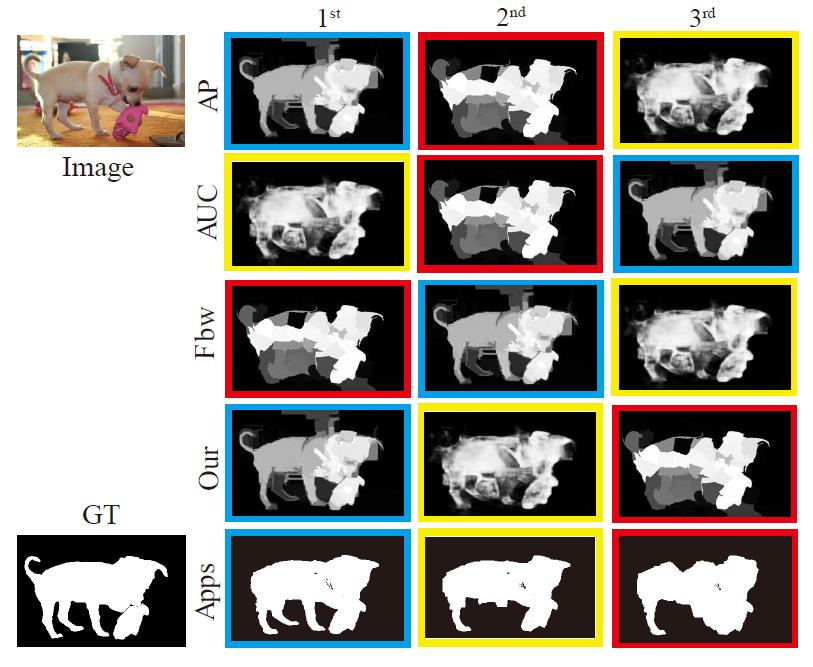

# S-measure: A new way to evaluate foreground maps (IJCV2021)

## Publication

**Structure-measure: A new way to evaluate foreground maps.**  **IJCV2021** 

[[pdf](https://link.springer.com/article/10.1007/s11263-021-01490-8)][[中译版](https://dengpingfan.github.io/papers/[2021][IJCV]Smeasure_Chinese.pdf)]

## Usage

Requirement:
  
    1. Matlab
    
Matlab Example
    
    You can just run the demo.m or demo2.m to get the evaluation results.
    Run demo1.m can get each map's score in the result folder. Run demo2.m can get the average S-measure score in the matlab command window.
    
## Python version: 
https://github.com/zzhanghub/eval-co-sod

## If our code is useful for you, please cite our paper

	@article{Cheng2021sMeasure,
  	 title={Structure-measure: A New Way to Evaluate Foreground Maps},
	 author={Ming-Ming Cheng and Deng-Ping Fan},
	 journal={International Journal of Computer Vision (IJCV)},
	 year={2021},
	 volume={},
	 number={},
	 pages={},
	 doi = {10.1007/s11263-021-01490-8},
	}
 	
	
